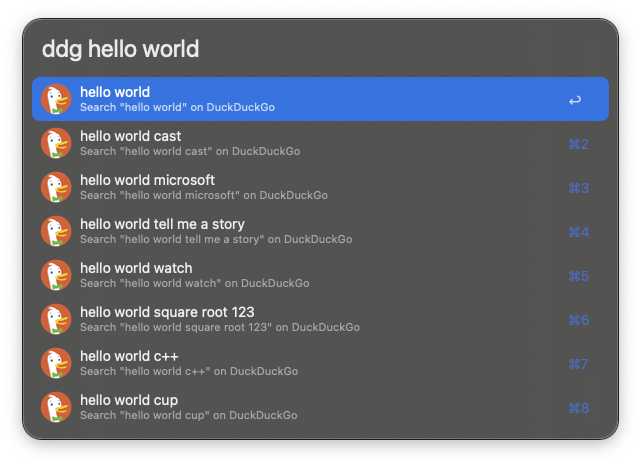

#  DuckDuckGo Suggest | Alfred Workflow

Get instant search suggestions from DuckDuckGo as you type in Alfred. This workflow provides fast, real-time autocomplete suggestions directly from DuckDuckGo's API, helping you find what you're looking for faster.

## Download

- Available on the Alfred Gallery. [Get it here](https://alfred.app/workflows/vanstrouble/duckduckgo-suggest/).
- You can also download it directly from GitHub [here](https://github.com/vanstrouble/duckduckgo-suggest-alfred-workflow/releases).

## Usage

Start typing your search query in Alfred using your configured keyword (default: `ddg` or your preferred trigger).

- **Keyword:** `[your-keyword] [search query]`

#### Examples:

| Query Input          | Result                                          |
|----------------------|-------------------------------------------------|
| `weather`            | Shows: weather, weather forecast, weather map, etc. |
| `alfred workflow`    | Shows: alfred workflow, alfred workflow tutorial, etc. |
| `javascript`         | Shows: javascript, javascript tutorial, javascript array, etc. |

## Acknowledgments

This workflow is inspired in [Google Suggest](https://alfred.app/workflows/alfredapp/google-suggest/) by Alfred Team.
